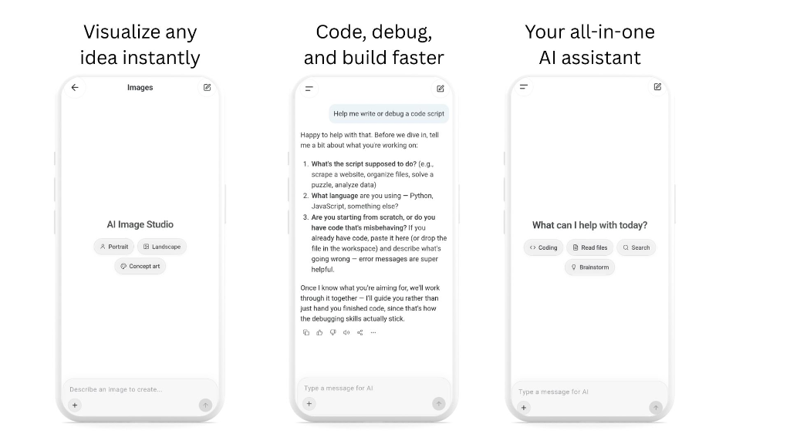

# Build X

<p align="center">
  
</p>

<p align="center">
  <strong>Next-Generation Autonomous AI Assistant & Multimodal Intelligence Client</strong>
</p>

<p align="center">
  <a href="https://github.com/MMUU6699/build-x3"></a>
  <a href="https://buildxcom.netlify.app/"></a>
  <a href="https://flutter.dev"></a>
  <a href="https://build.nvidia.com"></a>
  <a href="https://github.com/MMUU6699/build-x3"></a>
</p>

---

## 🌟 Overview

**Build X** is an advanced, privacy-first, cross-platform autonomous artificial intelligence application built with Flutter. Powered by state-of-the-art foundation models via **NVIDIA NIM** (including `z-ai/glm-5.3` and `Nemotron`), Build X delivers sub-second conversational intelligence, multimodal visual reasoning, and autonomous computer-use workflows in an elegant, modern interface.

Whether analyzing complex diagrams, writing code, reasoning across difficult logical puzzles, or orchestrating agent tasks, Build X is designed to feel fluid, intuitive, and remarkably fast.

---

## ✨ Key Features

### 🧠 High-Speed Multimodal Intelligence
- **Powered by `z-ai/glm-5.3`**: Industry-leading conversational agility, factual precision, and multimodal vision understanding.
- **Deep Reasoning Engine**: Toggleable thinking mode with structured reasoning tags and adjustable thinking effort (Off, Low, Medium, High).
- **Multimodal Image Analysis**: Upload screenshots, photos, diagrams, and receive detailed breakdowns, code extractions, and answers.
- **Streaming Response Architecture**: Sub-second token delivery with smooth typing animation.

### 🌐 Comprehensive Arabic & International Localization
- **Complete Native Arabic Support**: Meticulously localized interface in Modern Standard Arabic with full Right-to-Left (RTL) mirror support.
- **Dynamic Language Switching**: Switch effortlessly between Arabic, English, and Simplified Chinese directly from Settings.
- **Direction-Aware Layouts**: Directionally flipped navigation arrows, list indicators, and alignment tailored for RTL typography.

### 🎨 Clean, Modern Glassmorphism UI
- **Adaptive Dark & Light Modes**: Seamless transition between dark obsidian theme and clean minimalist light theme.
- **Modernized Chat Bar**: Fixed, non-collapsing rounded input card with intuitive controls, attachment sheet, and ergonomic send button.
- **Refined Side Drawer**: Pinned chats, categorized navigation (Images, Library, Projects, Scheduled, Plugins), and user profile management.

### 🔒 Enterprise-Grade Privacy & Security
- **Secure Secret Storage**: API keys are isolated in native platform keychains (`FlutterSecureStorage`) and excluded from unencrypted backups.
- **Fail-Safe Auth**: Clean Supabase integration supporting Google OAuth, email authentication, and local session preservation.
- **Zero Secret Leakage**: Strict code-sanitization architecture ensuring no sensitive API tokens are hardcoded or tracked in source control.

---

## 🚀 Getting Started

### Prerequisites
- **Flutter SDK**: `^3.24.0` or newer
- **Dart SDK**: `^3.5.0`
- **Android Studio / Xcode** (for mobile builds)
- **NVIDIA NIM API Key** (or your own model provider endpoint)

### Installation

1. **Clone the repository:**
   ```bash
   git clone https://github.com/MMUU6699/build-x3.git
   cd build-x3
   ```

2. **Install Flutter dependencies:**
   ```bash
   flutter pub get
   ```

3. **Run on connected device or emulator:**
   ```bash
   flutter run
   ```

---

## 📦 Building for Production

### Android Release APK
To build a signed, optimized release APK:

```powershell
# Windows PowerShell
.\tool\build_android.ps1
```

```bash
# macOS / Linux
./tool/build_android.sh apk
```

The compiled APK will be generated at:
```
build/app/outputs/flutter-apk/app-release.apk
```

---

## ⚙️ Configuration

### Model & API Settings
Build X connects by default to high-performance inference endpoints via NVIDIA NIM. You can configure custom keys at runtime or via environment variables:

| Environment Variable | Description |
|----------------------|-------------|
| `NVIDIA_GLM_API_KEY` | API Key for `z-ai/glm-5.3` Chat & Vision |
| `NVIDIA_NEMOTRON_API_KEY` | API Key for Nemotron Work Agent |
| `BUILD_X_API_KEY` | General Build X provider key fallback |

To pass keys at compile time:
```bash
flutter build apk --dart-define=NVIDIA_GLM_API_KEY=your_key_here
```

---

## 🏗️ Architecture

```
build-x/
├── lib/
│   ├── core/              # Services, database gateways, configuration, secure storage
│   ├── features/
│   │   ├── auth/          # Authentication flows (Google OAuth, Email/Password)
│   │   ├── chat/          # Chat UI, thinking cards, reasoning sliders, message rendering
│   │   ├── home/          # Home layouts, navigation drawer, modern chat input bar
│   │   ├── settings/      # Settings pages (General, Display, Language, About, Providers)
│   │   └── work/          # Work Mode agent timeline, tools view, and execution surface
│   ├── l10n/              # ARB localization bundles (Arabic, English, Chinese)
│   └── theme/             # Design tokens, color palettes, typography, theme factory
├── supabase/              # Supabase database migrations & Edge Functions
└── tool/                  # Build scripts and localization automation utilities
```

---

## 🔗 Official Links

- **Repository**: [https://github.com/MMUU6699/build-x3.git](https://github.com/MMUU6699/build-x3.git)
- **Official Website**: [https://buildxcom.netlify.app/](https://buildxcom.netlify.app/)
- **Release APK**: [v1.0.0 Direct Download](https://github.com/MMUU6699/build-x3/releases/download/v1.0.0/app-release.apk)
- **Author**: MMUU6699

---

## 📄 License

This project is licensed under the MIT License. See [LICENSE](LICENSE) for details.
